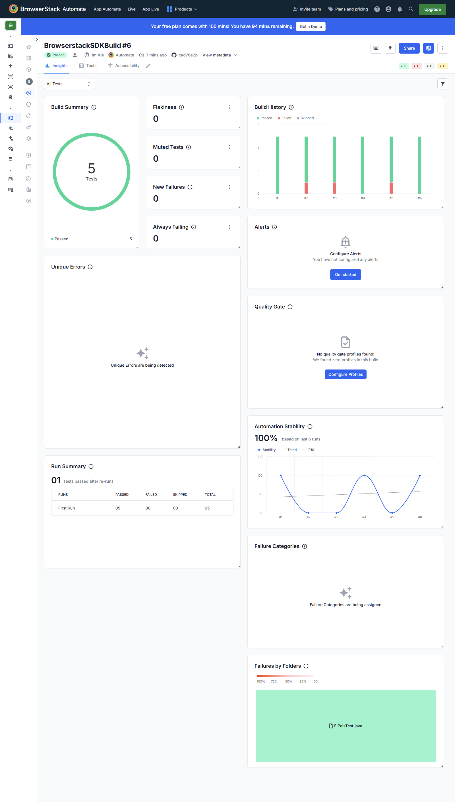

# El País Scraper

This project scrapes opinion articles from El País, translates the titles from Spanish to English, and analyzes frequently used words. It supports both local and cross-browser testing via BrowserStack using TestNG.

## Requirements

- Java 17+
- Maven
- ChromeDriver (for local testing)
- BrowserStack account (for cross-browser testing)

## BrowserStack Build URL

https://automate.browserstack.com/projects/ELPaisAutomation/builds/BrowserstackSDKBuild/6?public_token=80e0976e82297716b48f8bfc0fc6f24d66235037a1a9417d5aa49146db675c5c

